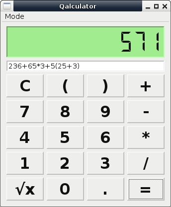
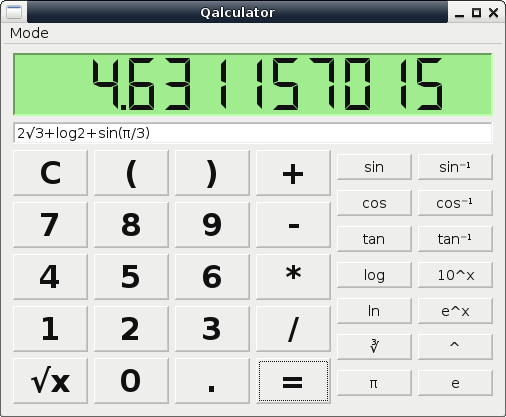

# Qalculator

A simple and scientific Calculator written in PyQt5  

### Description

This is a very simple calculator.  
It has also scientific mode functions (sin, cos, log, ln).  
View the answer in LCD display like widget.  

### Installation
First Install dependencies...  
* python3  
* python3-pyqt5  

To Install qalculator open terminal inside project root directory.  
And then run following command..  
`$ sudo pip3 install .`  

Qalculator will be automatically added to applications menu.  

To uninstall run..  
`$ sudo pip3 uninstall qalculator`  

### Usage

To run after installing, launch from application menu or in commandline type command..  
 
`$ qalculator`  

### Screenshots

Simple Calculator Mode  

Scientific Calculator Mode  

