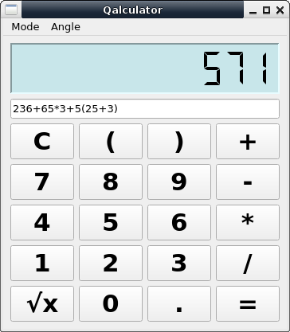

# Qalculator

A simple and scientific Calculator written in PyQt4  

**Dependency** = python3, python3-pyqt4  

### Description

This is a very simple calculator.  
It has also scientific mode functions (sin, cos, log, ln).  
View the answer in LCD display like widget.  

### Installation

To Install qalculator open terminal inside qalculator-master directory.  
And then run following command..  
`$ sudo pip3 install .`  

Qalculator will be automatically added to applications menu.  

To uninstall run..  
`$ sudo pip3 uninstall qalculator`  

### Usage

To run after installing, type command..  
 
`$ qalculator`  

If you want to run the calculator without/before installing, then  
Open terminal and change directory to qalculator-master and run  
  
`$ ./run.sh`  

### Screenshots

Simple Calculator Mode  

Scientific Calculator Mode  

